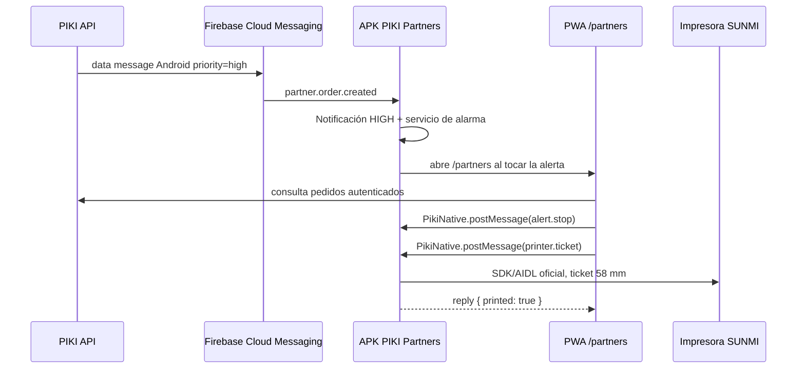

# Arquitectura del bridge Android SUNMI y alertas de pedido

## Objetivo

PIKI Partners sigue siendo una PWA para que la operativa, catálogo y pedidos se mantengan centralizados. El wrapper Android instalado en el SUNMI V2 añade únicamente capacidades que un navegador no puede garantizar: impresión térmica integrada, recepción FCM prioritaria, alarma persistente y ejecución fiable en segundo plano.



## Componentes

| Componente | Responsabilidad | Regla de seguridad |
|---|---|---|
| PWA `/partners` | Interfaz, roles, aceptación, `ready`, catálogo, pausa de productos | Nunca maneja secretos Firebase ni SDK SUNMI |
| API PIKI | Decide destinatario, registra tokens, emite Web Push o FCM | No manda el detalle completo del pedido en la notificación |
| FCM | Despierta el Android con prioridad alta | Mensajes data-only con TTL de 60 segundos |
| APK PIKI Partners | WebView endurecido, FCM, alarma y gateway de impresión | Solo permite `https://pikidelivery.com` |
| Bridge `PikiNative` | Contrato de mensajes entre PWA y Android | `WebMessageListener` con origen permitido; sin `addJavascriptInterface` |
| Gateway SUNMI | Traduce tickets a SDK/AIDL oficial del modelo adquirido | Interfaz aislada y validación de campos antes de imprimir |

## Contrato del bridge

La PWA usa `client/src/lib/nativeBridge.ts`. Cada mensaje usa este sobre:

```json
{
  "channel": "piki-partners",
  "requestId": "uuid",
  "command": { "action": "printer.ticket", "ticket": { "orderCode": "..." } }
}
```

Acciones permitidas:

| Acción | Dirección | Uso |
|---|---|---|
| `device.info` | PWA → Android | Detectar comandero y gateway disponible |
| `push.token` | PWA → Android | Obtener token FCM después de login partner |
| `alert.start` | PWA → Android | Iniciar alarma local para un pedido visible |
| `alert.stop` | PWA → Android | Detener alarma al aceptar o silenciar |
| `printer.ticket` | PWA → Android | Imprimir ticket validado de 58 mm |

El wrapper valida canal, longitud de `requestId`, formato de pedido, número de líneas y tamaño de cada texto. El WebView bloquea navegación externa y no expone interfaces JavaScript universales.

## Notificaciones de alta prioridad

El backend ya incluye dos transportes por establecimiento en `partnerPushSubscriptions`:

- `fcm` para el APK del SUNMI;
- `web_push` como respaldo si se usa la PWA en navegador.

Al crear un pedido, `notifyPartnersOfNewOrder` busca los terminales asociados al comercio. Para FCM, emite `android.priority = high`, `direct_boot_ok = true` y TTL de 60 segundos. El APK recibe `partner.order.created`, crea un canal Android de importancia alta y lanza `OrderAlertServiceImpl` en primer plano con sonido de alarma y vibración.

La alerta es persistente mientras exista el pedido alertado. Se detiene al aceptar o silenciar desde PIKI Partners mediante `alert.stop`. La PWA vuelve a consultar el API para mostrar el pedido; no confía en el payload push para mostrar líneas, importes o información sensible.

## Alta de un comandero

1. El técnico instala el APK y carga el `google-services.json` de **PIKI Partners Android**.
2. El Android abre `https://pikidelivery.com/partners`.
3. El partner inicia sesión y selecciona su establecimiento.
4. Pulsa `Activar alertas SUNMI`.
5. El bridge entrega el token FCM a la PWA.
6. La PWA llama a `partner.registerNativeDevice`.
7. El backend guarda el token asociado a `ownerOpenId` y `storeId`.
8. Se crea un pedido de prueba y se confirma: push, sonido, apertura de PWA, aceptación e impresión.

## Configuración de producción pendiente de credenciales

El código queda preparado pero la activación real de FCM exige crear o seleccionar un proyecto Firebase de PIKI y cargar secretos solo en el entorno servidor:

```text
FCM_PROJECT_ID
FCM_CLIENT_EMAIL
FCM_PRIVATE_KEY
VAPID_PUBLIC_KEY
VAPID_PRIVATE_KEY
VAPID_SUBJECT
```

`FCM_PRIVATE_KEY` debe almacenarse como secreto de despliegue, con los saltos de línea serializados como `\n`; jamás debe incluirse en la PWA, el APK, Git o tickets de soporte. También debe añadirse el archivo de configuración Firebase del proyecto Android a la distribución privada, no a este repositorio público.

La migración que debe aplicar antes del piloto es:

```bash
mysql "$DATABASE_URL" < drizzle/0010_partner_push_subscriptions.sql
```

## Impresión SUNMI

El módulo nativo contiene un `SunmiPrinterGateway` con una interfaz `VendorSunmiPrinterAdapter`. La PWA ya puede solicitar tickets, pero el adaptador falla de forma segura con `SDK_NOT_BOUND` hasta compilar el SDK/AIDL oficial del modelo SUNMI V2 adquirido.

Antes de activar la venta, el integrador debe conectar el paquete oficial del proveedor al adaptador y validar: inicialización, texto UTF-8, corte/avance, tapa abierta, falta de papel, cola ocupada y reintento. Este aislamiento evita acoplar el frontend a APIs propietarias y evita prometer impresión si la variante física instalada no la soporta.

## Reglas de operación

- No usar pantalla completa de emergencia ni categorías de llamada para pedidos; la alarma usa notificación de alta importancia y servicio de audio visible.
- El partner puede silenciar la alarma; el pedido permanece en la bandeja hasta que se procese.
- Si FCM no está disponible, Web Push conserva el aviso visual de fondo, pero no reemplaza la persistencia del servicio nativo.
- Si no hay red, la última bandeja se mantiene y ninguna aceptación se considera confirmada hasta respuesta del servidor.
- El canal Android aparece en ajustes: el comercio puede ajustar volumen/vibración según normativa local y horario.
